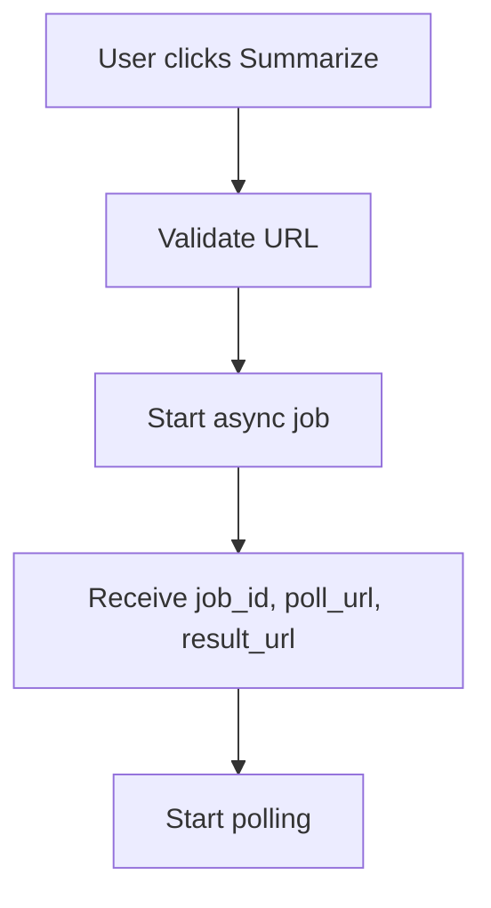
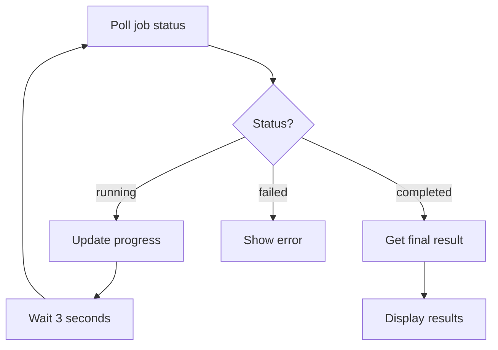
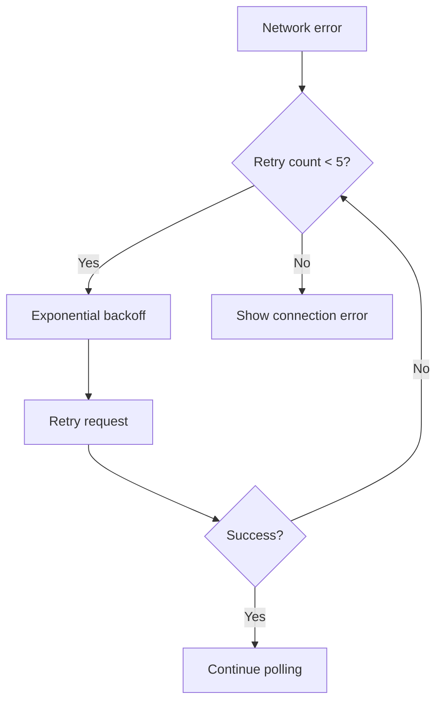

# Async YouTube Summarization Implementation

## Overview
This document describes the complete implementation of the async YouTube summarization feature, including the API structure, frontend components, and testing procedures.

## 🚀 Features Implemented

### 1. **Async API Integration**
- **Start Job**: POST `/api/summarize/async`
- **Check Status**: GET `/api/summarize/status/{jobId}`
- **Get Result**: GET `/api/summarize/result/{jobId}`
- **Bundle Data Support**: Full transcript, segments, SRT subtitles

### 2. **Frontend Components**
- **Async Hook**: `useAsyncYouTubeSummarizer` for state management
- **Bundle Display**: Component to show transcript, segments, and SRT data
- **Result Display**: Comprehensive result viewer with tabs
- **Progress Tracking**: Real-time progress updates with retry logic

### 3. **Enhanced User Experience**
- **Real-time Progress**: Visual progress bar with percentage
- **Processing Logs**: Live updates of what's happening
- **Error Handling**: Comprehensive error messages and retry logic
- **Bundle Data**: Full access to transcript, segments, and metadata

## 📁 File Structure

```
lib/
├── hooks/
│   └── use-async-youtube-summarizer.ts    # Async state management hook
├── types/
│   └── api.ts                            # Updated with async types
└── api-client.ts                         # Updated with async endpoints

components/
├── youtube/
│   ├── bundle-display.tsx               # Bundle data display component
│   └── youtube-result-display.tsx        # Enhanced result display
└── ui/
    └── scroll-area.tsx                  # New scroll area component

app/(dashboard)/youtube-summarizer/
└── page.tsx                             # Updated main page

test/
└── async-youtube-summarization-test.html # Comprehensive test file
```

## 🔧 API Types

### Async Summarize Request
```typescript
interface AsyncSummarizeRequest {
  content_type: 'link';
  source: {
    type: 'url';
    data: string;
  };
  options: {
    mode: 'detailed' | 'brief' | 'bundle';
    language: string;
    format?: 'bundle';
    focus?: 'summary' | 'analysis' | 'key_points';
  };
}
```

### Job Status Response
```typescript
interface JobStatusResponse {
  success: boolean;
  data: {
    id: string;
    status: 'pending' | 'running' | 'completed' | 'failed';
    progress: number;
    stage: 'initializing' | 'processing' | 'completed' | 'failed';
    error: string | null;
    created_at: string;
    updated_at: string;
    logs: Array<{
      timestamp: string;
      level: string;
      message: string;
      data: Record<string, any>;
    }>;
    metadata: {
      processing_started_at: string | null;
      processing_completed_at: string | null;
      total_processing_time: string | null;
      file_count: number;
      tokens_used: number;
      confidence_score: number;
    };
  };
}
```

### Bundle Data Structure
```typescript
interface BundleData {
  video_id: string;
  language: string;
  format: string;
  article: string;                    // Full formatted article
  summary: string;                    // AI-generated summary
  json: {
    segments: Array<{
      text: string;
      start: number;
      duration: number;
    }>;
  };
  srt: string;                       // SRT subtitle format
  meta: {
    ai_summary: string;
    ai_model_used: string;
    ai_tokens_used: number;
    ai_confidence_score: number;
    processing_time: string;
    merged_at: string;
  };
}
```

## 🎯 Usage Examples

### 1. Basic Async Summarization
```typescript
import { useAsyncYouTubeSummarizer } from '@/lib/hooks/use-async-youtube-summarizer';

const MyComponent = () => {
  const {
    status,
    progress,
    result,
    error,
    startJob,
    cancelJob,
    reset
  } = useAsyncYouTubeSummarizer();

  const handleSummarize = async () => {
    await startJob('https://www.youtube.com/watch?v=VIDEO_ID', 'en', 'bundle');
  };

  return (
    <div>
      <button onClick={handleSummarize} disabled={status === 'processing'}>
        {status === 'processing' ? `Processing... ${progress}%` : 'Summarize'}
      </button>
      
      {result && (
        <YouTubeResultDisplay result={result} />
      )}
    </div>
  );
};
```

### 2. Bundle Data Display
```typescript
import BundleDisplay from '@/components/youtube/bundle-display';

const MyComponent = ({ bundle }) => {
  return (
    <BundleDisplay 
      bundle={bundle}
      onCopy={(content, type) => {
        navigator.clipboard.writeText(content);
        console.log(`Copied ${type} to clipboard`);
      }}
      onDownload={(content, filename, type) => {
        // Handle download
      }}
    />
  );
};
```

## 🔄 Async Workflow

### 1. **Job Initialization**


### 2. **Polling Process**


### 3. **Error Handling**


## 🧪 Testing

### 1. **Manual Testing**
Open `test/async-youtube-summarization-test.html` in your browser:

1. **Set Authentication Token**:
   ```javascript
   localStorage.setItem('auth_token', 'your-token-here');
   ```

2. **Test Basic Flow**:
   - Enter a YouTube URL
   - Select language and mode
   - Click "Start Async Job"
   - Monitor progress and logs
   - View results when completed

3. **Test Bundle Data**:
   - Use mode "Bundle (Full Data)"
   - Check all tabs: Summary, Details, Bundle Data
   - Verify transcript, segments, and SRT data

### 2. **Error Scenarios**
- **Network Issues**: Test with backend offline
- **Invalid URLs**: Test with non-YouTube URLs
- **Authentication**: Test without auth token
- **Timeout**: Test with very long videos

## 📊 Performance Features

### 1. **Smart Polling**
- **Base Interval**: 3 seconds
- **Exponential Backoff**: Gradual increase with jitter
- **Max Attempts**: 100 (5 minutes)
- **Retry Logic**: 5 retries with exponential backoff

### 2. **Memory Management**
- **Automatic Cleanup**: Polling stops on completion/error
- **Component Unmount**: Cleanup on component destruction
- **State Reset**: Proper state management

### 3. **User Experience**
- **Real-time Updates**: Progress bar and status messages
- **Processing Logs**: Live updates of backend activity
- **Error Recovery**: Automatic retry with user feedback
- **Cancellation**: Ability to cancel long-running jobs

## 🔧 Configuration

### 1. **API Endpoints**
```typescript
const API_ENDPOINTS = {
  SUMMARIZE_ASYNC: '/summarize/async',
  SUMMARIZE_STATUS: '/summarize/status',
  SUMMARIZE_RESULT: '/summarize/result',
};
```

### 2. **Polling Configuration**
```typescript
const POLL_INTERVAL = 3000;        // 3 seconds
const MAX_RETRIES = 5;             // 5 retries
const MAX_POLL_ATTEMPTS = 100;     // 5 minutes max
```

### 3. **Bundle Data Options**
```typescript
const bundleOptions = {
  mode: 'bundle',                  // Full bundle data
  format: 'bundle',               // Bundle format
  focus: 'summary',                // Focus on summary
};
```

## 🚨 Error Handling

### 1. **Network Errors**
- **Connection Issues**: Automatic retry with backoff
- **Timeout**: Clear error message with suggestions
- **CORS**: Specific CORS configuration guidance

### 2. **Job Errors**
- **Validation**: Clear field-specific error messages
- **Processing**: Backend error details
- **Authentication**: Login requirement messages

### 3. **User Feedback**
- **Loading States**: Visual progress indicators
- **Error Messages**: User-friendly error descriptions
- **Success Messages**: Confirmation of completed actions

## 📈 Monitoring & Debugging

### 1. **Console Logging**
```typescript
console.log('Starting async job:', request);
console.log('Job status response:', statusResponse);
console.log('Result response:', resultResponse);
```

### 2. **Status Tracking**
- **Job ID**: Unique identifier for tracking
- **Progress**: Percentage completion
- **Stage**: Current processing stage
- **Logs**: Detailed processing information

### 3. **Error Tracking**
- **Retry Count**: Number of retry attempts
- **Error Type**: Network, validation, or processing
- **Error Message**: Detailed error information

## 🎉 Benefits

### 1. **No More Timeouts**
- Long videos processed asynchronously
- No frontend timeout issues
- Better user experience

### 2. **Rich Data Access**
- Full transcript with timestamps
- SRT subtitle format
- Detailed metadata
- AI processing information

### 3. **Real-time Feedback**
- Live progress updates
- Processing logs
- Error recovery
- Cancellation support

### 4. **Scalable Architecture**
- Hook-based state management
- Reusable components
- Type-safe API integration
- Comprehensive error handling

## 🔮 Future Enhancements

### 1. **Additional Features**
- **Batch Processing**: Multiple videos at once
- **Custom Formats**: Additional export formats
- **Advanced Filtering**: Segment filtering and search
- **Real-time Collaboration**: Shared processing sessions

### 2. **Performance Optimizations**
- **Caching**: Result caching for repeated requests
- **Compression**: Bundle data compression
- **Streaming**: Real-time result streaming
- **Background Processing**: Queue management

### 3. **Integration Features**
- **Webhook Support**: Server-sent events
- **API Keys**: External API integration
- **Analytics**: Usage tracking and metrics
- **Notifications**: Email/SMS notifications

This implementation provides a robust, scalable, and user-friendly async YouTube summarization system with comprehensive bundle data support! 🚀


